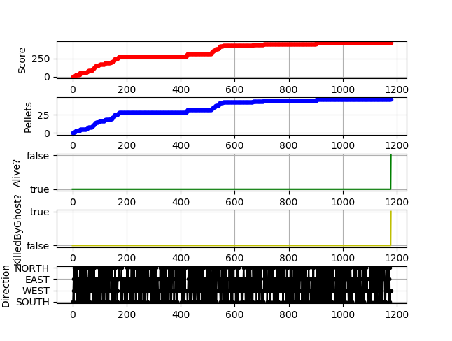
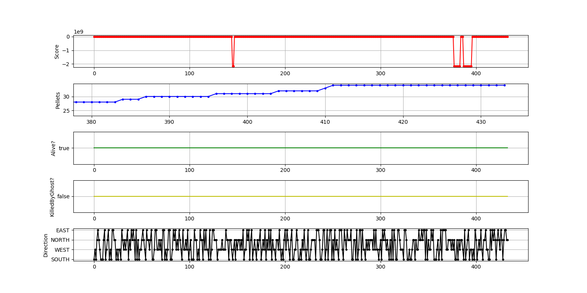
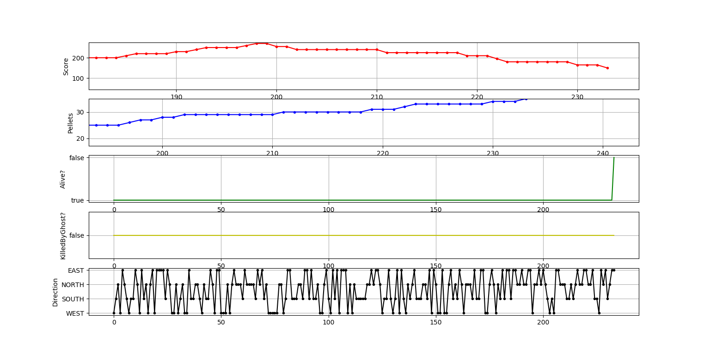
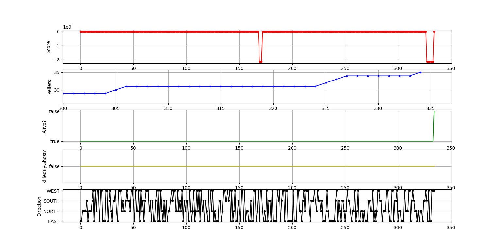
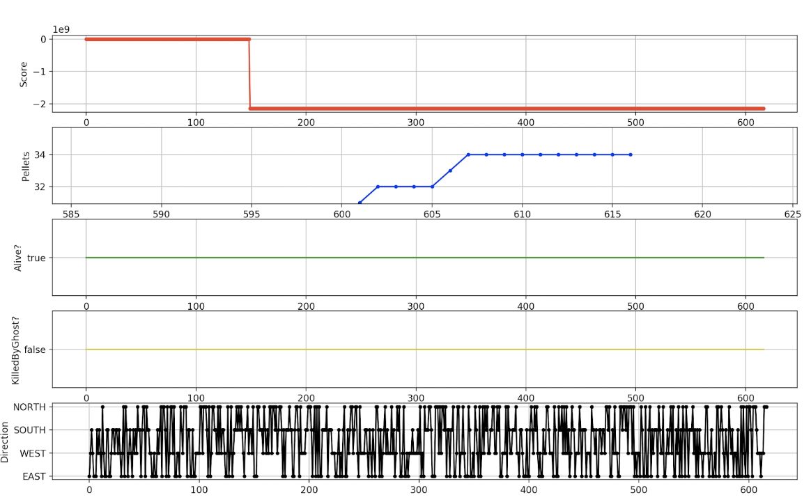

<<<<<<< HEAD
Exercise 7
- There is now 100% coverage of all methods and lines in the PlayerCollisions and DefaultPlayerInteractionMap classes which were previously
completely untested. As a result, all the possible collisions between units - player, ghost and pellet - have been covered as per the decision 
table and thus, we have achieved 94% line coverage of the CollisionInteractionMap, indicating high coverage of the overall collision functionality.
- The collision functionality, in CollisionInteractionMap, that is unchecked involves the handling of the collision between two colliding parties, if the handler is null or if the
collider is null. Moreover, it's not tested that when there are interfaces that the class inherits from, they will get added to the list of classes and interfaces that is output.
=======
Exercise 8
- To test a method like this, we can inject a mocked/fixed-seed value that implements the injected Random class (that acts as a
dependency to the class under test) that will cause the mock implementation to return a predefined number.
- In this case, you always get the same sequence of numbers so it makes the test deterministic and useful as well.
- However, the production code should also have a real class implementation that returns actually random numbers for when the game
runs.

Exercise 9
- Flaky tests are tests that can both pass and randomly fail with the same code. The smoke test is flaky since the pac-man is not always eaten
by the ghost.
- A test can also become flaky when it grows too large in size, there are other threads or tests running in parallel that can disrupt its flow,
it is dependent on certain 3rd party systems etc.
- Developers should aim to write tests that are small in size, keep tests isolated so they can execute without interfering each other, limit
calls to external systems and develop tools that can monitor flakiness in tests throughout.

Sources:
Gang, The Code. “Flaky Tests - A War That Never Ends.” Hacker Noon, Hacker Noon, 5 Dec. 2017, 
<https://hackernoon.com/flaky-tests-a-war-that-never-ends-9aa32fdef359>
Stričević, Nebojša. “How to Deal With and Eliminate Flaky Tests.” Semaphore, 27 May 2015, 
<https://semaphoreci.com/community/tutorials/how-to-deal-with-and-eliminate-flaky-tests>
Micco, John. “Flaky Tests at Google and How We Mitigate Them.” Google Testing Blog, 27 May 2016, 
<https://testing.googleblog.com/2016/05/flaky-tests-at-google-and-how-we.html>

Exercise 10
- 100% code coverage is a good thing to have as all areas of the program are exercised by a set of test cases and it helps in eliminating defects, dead code and it is better than testing
by line. 
- However, having 100% code coverage reflects successful coverage of only the test code that has been written - thus, it does not ensure that the program is fully bug-free.
Thus, if a certain required function has not been implemented, structural testing methods (such as code coverage) are quite limited as they only look at the code structure already there.

Exercise 11
- While mocks are quite advantageous, they add extra complexity to the code and also result in tests which are difficult to reuse if you are planning to write a large number
of them. Thus, mock methods often end up being repeated for each test and you end up with objects communicating in complex ways, as opposed to a function without dependencies.

Source: Llopis, Noel. “Mock Objects: Friends Or Foes?” Games from Within, 26 July 2010, 
<http://gamesfromwithin.com/mock-objects-friends-or-foes>

Exercise 12
- A test can execute slower if it depends on data from the database or other storage systems - for example, unit tests are faster than integration and UI-based tests which test
the whole system to see whether specs are met.
- Tests must be fast as developers need quick feedback on each commit; otherwise, developers will see no point in running them.
- The best way to mitigate this is to isolate these tests in their own test suite - they should then be made/re-written to test business logic without unnecessary 
usage of the database or other storage systems.

Source:
Serna, Benito. “Slow Tests?... How to Remove the Database from Your Tests and Make Them Fast!” Benito Serna, 
<https://bhserna.com/slow-rails-test-suite-how-to-remove-the-database-from-your-tests-and-make-them-fast.html>

Exercise 13
- Mocking is good to use when working with code which cannot be used in isolation and allows for the functionality of the code to be tested in isolation. Thus, unit tests that interface
with the code can still be carried out without having to restart the project with a new codebase. However, if the code allows for individual component testing, then it is better to use
the state and not mock as it will add unnecessary complexity and also will not be reusable as the project is scaled up with more tests being written.

Exercise 14
- When Pacman is moving West and has eaten 15 pellets, the score starts alternating between a large negative number and the positive score for each extra pellet eaten.
- In some situations, after eating 28 pellets, pacman starts to lose 15 points from the score for each pellet eaten.
- Sometimes, Pacman randomly dies.
- Sometimes the game randomly ends while pacman is alive and there are still pellets remaining.

Exercise 15

Graph of normal behaviour

In this graph, the normal behaviour can be seen when the game is running with DefaulPointCalculator. The game ends once all the pellets are collected or when a ghost kills pacman. The score increases every time a pellet is consumed. 

Graph of abnormal behaviour

In this graph it can be seen that when player consumes 34 pellets and direction is north, the does not die or complete the game but the game ends.

In this graph, it can be seen that after the player consumes 28 pellets, the score reduces by 15 points.

This graph shows that that once the player consumes 34 pellets, the player dies.

In this graph, it can be seen that when the player is going west and has consumed 15 pellets, the score drops to a large negative number.

Exercise 16
- Running gradle static analysis does not give any warnings. There are no spotbug warnings because the static analysis tool cannot analyse code from a plugin and since Amazing Point calculator is a plugin, it does not work for that. The "Injection" and "Using components with known vulnerabilities" risks from the OWASP top 10 vulnerabilities list applies to this piece of code. 

Exercise 17
- A custom class loader can be used, which lets you set the permissions to what classes this loaded class can communicate with.
- Security Manager can be added to the thread of in which the class runs which easily enables you to throw securityException when the permissions are violated
- Run the classes and their code in a seperate thread which can be stopped if it takes too long. This will eliminate infinite loops.
>>>>>>> 5fd4aa85605695f559fe3ad523264663a08b9adf
