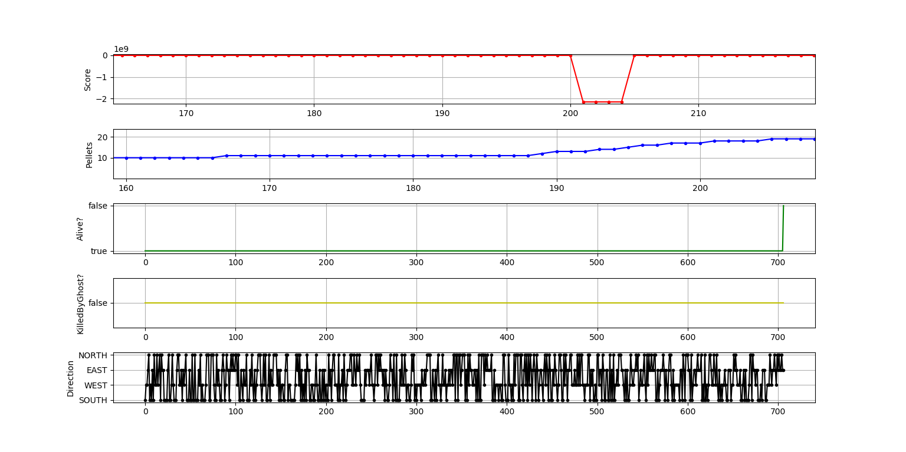

Exercise 9
- A flaky test is a test that passes sometimes and fails sometimes for the same configuration. 

Exercise 10
- 100% code coverage is a good thing to have as it forces the testing of all the functions. 
However,having 100% code coverage does not mean the code that is being tested is bug free. It is possible to achieve 100% code coverage even if some of the tests are not the most meaningful.

Exercise 11
-While mocks are quite advantageous, they add unnecessary complexity to the code and that results in complicated code, which is difficult to reuse for many different tests.
Thus, mock methods often end up being repeated for each test and you end up with objects communicating in complex ways, as opposed to a function without dependencies.

Exercise 12
-A single test can become slow if it initially tests the individual components (unit test) but then grows to test, say, the communication between those individual
components (integration testing). In fact, it is often found that slow tests tend to be integration and/or UI (acceptance) testing.
-It is important to keep the tests fast as developers need quick feedback on each commit; otherwise, developers will see no point in running them. The best way to mitigate 
this is to isolate these tests in their own test suite - then they should be made to test business logic without unnecessary usage of the database or other storage systems.

Exercise 13
-Mocking is most justified when working with code that was not written with unit testing in mind as that is code which is impossible to use in isolation.
Thus, it is helpful in situations that require new code that you are writing to be isolated from code you may have written in the past, not intended for testing.
-Moreover, it can also be used as training for when you start writing unit tests as you can filter out any new code you write.

Exercise 14

Exercise 15

Graph of normal behaviour

Graph of abnormal behaviour

